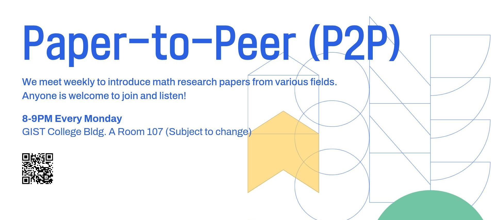

# Paper to Peer (P2P): A mathematics paper reading group

## About

This repository is for a **student journal club on mathematical concepts and research papers**. We aim to improve both research skills and academic interaction by:
  - Explaining mathematical concepts and trending research papers.
  - Sharing mathematical perspectives across different research areas.

One member gives a presentation each week. Previous and upcoming sessions are listed below.

## Members

- **Woojin Shin** ([@Adobby77](https://github.com/Adobby77))
- **Hongeun Im** ([@hongeun-im](https://github.com/hongeun-im))
- **Hyo-jeong Lee** ([@hjlee11190](https://github.com/hjlee11190))

## Schedule

### Fall 2026

- **Week 1** (Sep. 07, 2026) Signed Laplacians for Constrained Graph Clustering ([JSF Carrasco, H Sun, 2025](https://openreview.net/forum?id=MHaSq1LlTe)) - *Presenter: Hongeun Im*
- **Week 2** (Sep. 14, 2026) Matrix-weighted consensus and its applications ([Trinh et al., 2018](https://doi.org/10.1016/j.automatica.2017.12.024)) - *Presenter: Woojin Shin*
- **Week 3** (Sep. 21, 2026) Beyond Geometry: Comparing the Temporal Structure of Computation in Neural Circuits with Dynamical Similarity Analysis ([Ostrow et al., 2023](https://arxiv.org/abs/2306.10168)) - *Presenter: Hyo-jeong Lee*
- **Week 4** (Sep. 28, 2026) Parameterized Algorithms ([Cygan et al., 2016](https://www.mimuw.edu.pl/~malcin/book/parameterized-algorithms.pdf)) - *Presenter: Hongeun Im*
- **Week 5** (Oct. 05, 2026) Classification and Geometry of General Perceptual Manifolds ([Chung et al., 2018](https://journals.aps.org/prx/abstract/10.1103/PhysRevX.8.031003)) (1) - *Presenter: Hyo-jeong Lee*
